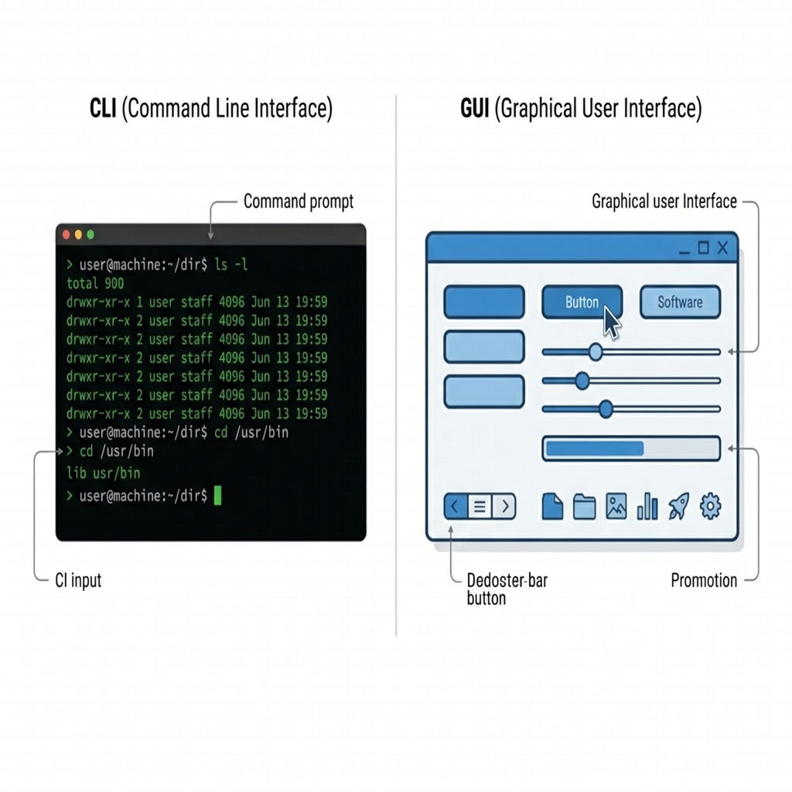
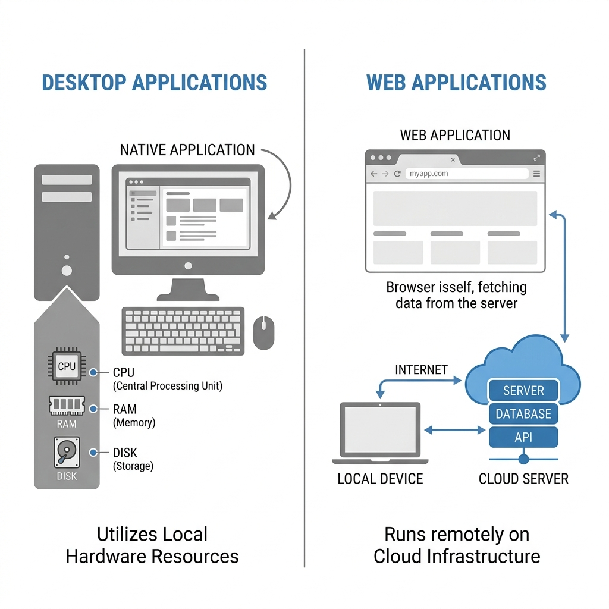
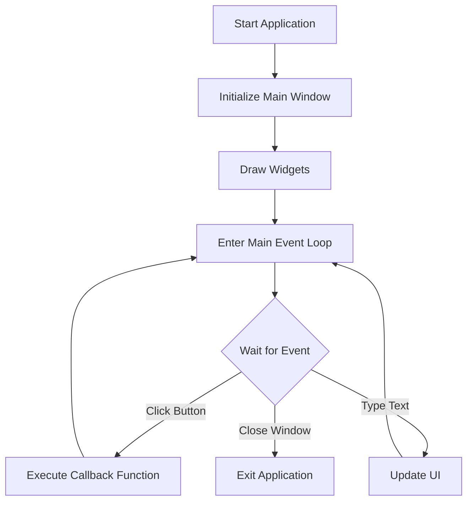

# Chapter 1: Introduction to Windows Desktop Application Development

Welcome to the beginning of your journey into Windows Desktop Application development! 

In an era dominated by web and mobile technologies, desktop applications remain a critical pillar of professional software. They provide unmatched performance, deep operating system integration, and offline reliability that web browsers simply cannot match.

---

## 🎯 Objectives
By the end of this chapter, you will:
- Understand what defines a desktop application.
- Differentiate between a Command Line Interface (CLI) and a Graphical User Interface (GUI).
- Compare Desktop applications with Web applications.
- Learn why Python and Tkinter are a powerful duo for rapid development.
- Grasp the core concepts of event-driven programming.

---

## 📖 Theory

### What is a Desktop Application?
A desktop application is a software program that runs locally on a computer's operating system (like Windows, macOS, or Linux). Unlike a web application that relies on an internet connection and a browser, a desktop application executes directly on the hardware, utilizing the local CPU, memory, and disk storage.

### GUI vs CLI

Before the advent of modern operating systems, all interactions with computers happened via the **Command Line Interface (CLI)**. Users had to memorize and type commands. 

Today, most applications use a **Graphical User Interface (GUI)**, which allows users to interact with visual elements like buttons, text fields, and windows.



> [!NOTE]
> While GUIs are more user-friendly, CLIs are still heavily used by developers for automation and scripting because they are faster to execute and easier to chain together.

### Desktop vs Web Applications

The debate between building a desktop app versus a web app is ongoing. Here is a breakdown:



| Feature | Desktop Application | Web Application |
| :--- | :--- | :--- |
| **Performance** | High (Direct access to hardware) | Medium (Constrained by browser) |
| **Offline Support**| Excellent | Limited |
| **OS Integration** | Deep (Registry, Startup, Files) | Restricted (Sandboxed) |
| **Distribution** | Requires installation (.exe, .msi) | Instant (via URL) |

### Why Python for Desktop Apps?
Python is famous for data science and web backends, but it is also an incredible tool for desktop applications. It offers:
- **Rapid Prototyping:** You can build a functioning GUI in minutes.
- **Vast Ecosystem:** You have access to thousands of libraries (networking, cryptography, database).
- **Readability:** Python's clean syntax makes maintaining a large desktop app much easier.

### Why Tkinter?
Tkinter is Python's de-facto standard GUI package. 
- It is **built-in** (no `pip install` required).
- It is lightweight and fast.
- It provides a solid foundation for learning GUI concepts that translate to heavier frameworks like PyQt or PySide.

---

## 📊 Architecture Overview

Windows applications do not run top-to-bottom like a standard Python script. They sit in a continuous loop, waiting for the user to do something.



This loop is called the **Event Loop**, and the functions triggered by events are called **Callbacks**.

---

## 💻 Code Examples: The Simplest Application

Here is what the smallest possible Tkinter application looks like:

```python
import tkinter as tk

# 1. Initialize the main window
root = tk.Tk()
root.title("My First App")
root.geometry("300x200")

# 2. Start the Event Loop
root.mainloop()
```

When you run this script, the code pauses at `root.mainloop()`. The window stays open until you explicitly close it.

---

## 💡 Tips
- **Keep it modular:** Don't put all your logic inside your GUI callbacks. Separate your visual code from your backend logic.
- **Learn the Grid:** Tkinter has several ways to place widgets on the screen, but the `grid` manager is the most robust and predictable.

---

## ⚠ Common Mistakes

> [!WARNING]
> **Blocking the Main Thread:** The biggest mistake beginners make is running a long task (like downloading a file or scanning a network) inside the event loop. If your callback takes 5 seconds to finish, your entire GUI will freeze for 5 seconds. We will learn how to handle this with *threading* in later chapters.

---

## 🧪 Exercises
1. Run the simple Tkinter code example on your machine.
2. Change the `root.geometry()` dimensions to make a tall, narrow window.
3. Add a `print("App is running!")` statement *before* the `mainloop()`. Where does it print?
4. Add a `print("App closed!")` statement *after* the `mainloop()`. When does it print?

---

## 📚 Summary
In this chapter, we explored the foundations of desktop applications. We compared GUIs with CLIs and Desktop apps with Web apps. We saw why Python and Tkinter are a great choice for our upcoming project, and we learned that desktop apps are fundamentally different from normal scripts because they rely on an **Event Loop**. 

In **Chapter 2**, we will dive deep into Tkinter's widgets and learn how to build interactive screens!
