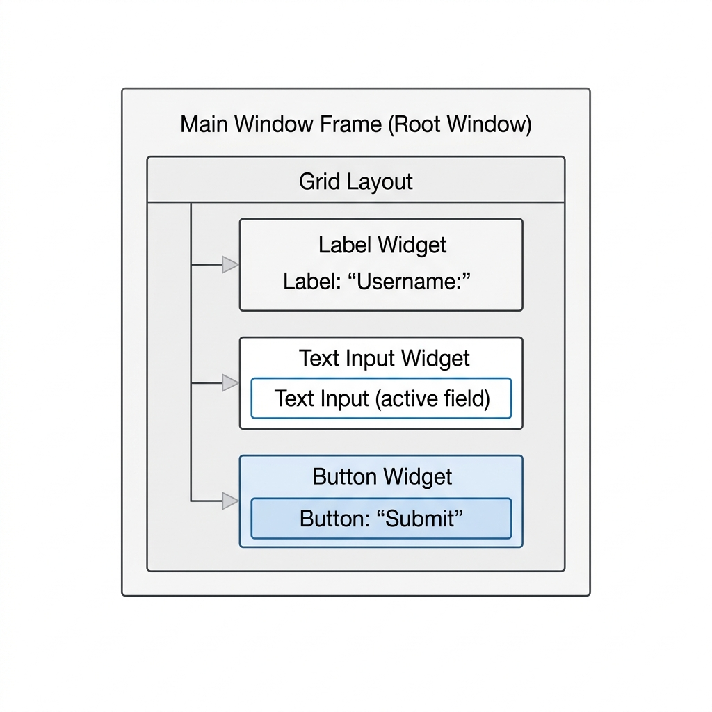

# Chapter 2: Understanding Tkinter

Before we build the WiFi Login application, we must master the tools we are building it with. In this chapter, we explore Tkinter, Python's standard GUI library. We will understand how to construct user interfaces by stacking visual components—known as widgets—and managing their layout.

---

## 🎯 Objectives
By the end of this chapter, you will:
- Understand the concept of the `Tk()` root window.
- Learn about the hierarchy of Tkinter widgets.
- Master Geometry Managers (`pack`, `grid`, and `place`).
- Discover Tkinter Control Variables (`StringVar`, `IntVar`, etc.).
- Learn how to trigger functions through Button events.

---

## 📖 Theory

### The Root Window: `Tk()`
Every Tkinter application starts with a single foundational element: the root window. 

```python
import tkinter as tk
root = tk.Tk()
```

The root window is the blank canvas of your application. It manages the operating system window decorations (the title bar, minimize/maximize/close buttons) and acts as the ultimate parent for every other visual element you create.

### What are Widgets?
A "Widget" (short for window gadget) is any visual element in a GUI. Buttons, text labels, input fields, and checkboxes are all widgets. 

In Tkinter, widgets are organized in a **hierarchy** or a tree structure. The `Tk()` root window is at the top. You place a `Frame` (a container widget) inside the root, and then you place a `Button` inside that `Frame`.



### Control Variables
Standard Python variables (`x = "Hello"`) don't work well with Tkinter if you want the GUI to update automatically when the variable changes. Tkinter provides specialized classes called **Control Variables**:
- `tk.StringVar()`
- `tk.IntVar()`
- `tk.BooleanVar()`

If you link a `StringVar()` to a `Label`, changing the `StringVar()` in your code instantly updates the text shown on the screen!

---

## 📊 Geometry Managers

Creating a widget doesn't automatically show it on the screen. You must tell Tkinter *where* to put it. This is done using a **Geometry Manager**. There are three main managers in Tkinter:

1. **`pack()`**: Stacks widgets against each other vertically or horizontally. (Good for simple layouts).
2. **`grid()`**: Places widgets in a 2D table of rows and columns, much like an Excel spreadsheet. (Best for complex forms and structured layouts).
3. **`place()`**: Places widgets at exact X and Y pixel coordinates. (Hard to maintain across different screen resolutions—use rarely).

> [!TIP]
> **Never mix `pack()` and `grid()` in the same parent window or frame!** Doing so will cause Tkinter to freeze as the two managers fight infinitely over how to size the window. Choose one for a specific container and stick with it.

---

## 💻 Code Examples: Creating a Login Form

Let's use `grid()` to create a simple form layout:

```python
import tkinter as tk

root = tk.Tk()
root.title("Simple Form")

# Create Widgets
lbl_username = tk.Label(root, text="Username:")
ent_username = tk.Entry(root)

lbl_password = tk.Label(root, text="Password:")
ent_password = tk.Entry(root, show="*")

btn_login = tk.Button(root, text="Login")

# Place Widgets using grid
lbl_username.grid(row=0, column=0, padx=10, pady=10)
ent_username.grid(row=0, column=1, padx=10, pady=10)

lbl_password.grid(row=1, column=0, padx=10, pady=10)
ent_password.grid(row=1, column=1, padx=10, pady=10)

btn_login.grid(row=2, column=0, columnspan=2, pady=10)

root.mainloop()
```

Notice the use of `padx` and `pady`? This adds padding (empty space) around the widgets so they don't look cramped together.

---

## ⚠ Common Mistakes

> [!WARNING]
> **Widget creation vs placement:** It is a common mistake to write:
> `my_label = tk.Label(root, text="Hello").pack()`
> 
> Because `.pack()` and `.grid()` return `None`, the variable `my_label` will be set to `None`, not the Label object! If you try to update the text later, your code will crash. Always separate creation from placement:
> ```python
> my_label = tk.Label(root, text="Hello")
> my_label.pack()
> ```

---

## 🧪 Exercises
1. Modify the form above to add an "Email" field between the Username and Password fields.
2. Change the Geometry Manager from `grid()` to `pack()`. What happens to the layout?
3. Create a Button that, when clicked, prints the text typed into the Username `Entry` widget to the console. (Hint: look up the `command=` parameter for Buttons and the `.get()` method for Entry widgets).

---

## 📚 Summary
In this chapter, we moved from the theory of desktop apps to the practical reality of Tkinter. We learned that everything is a Widget, and these widgets must be arranged using a Geometry Manager like `grid` or `pack`. We also explored how Tkinter uses Control Variables to keep the interface synchronized with the data.

Now that we know our tools, we are ready to plan our actual application. In **Chapter 3**, we will design the architecture and folder structure for our WiFi Login project.
