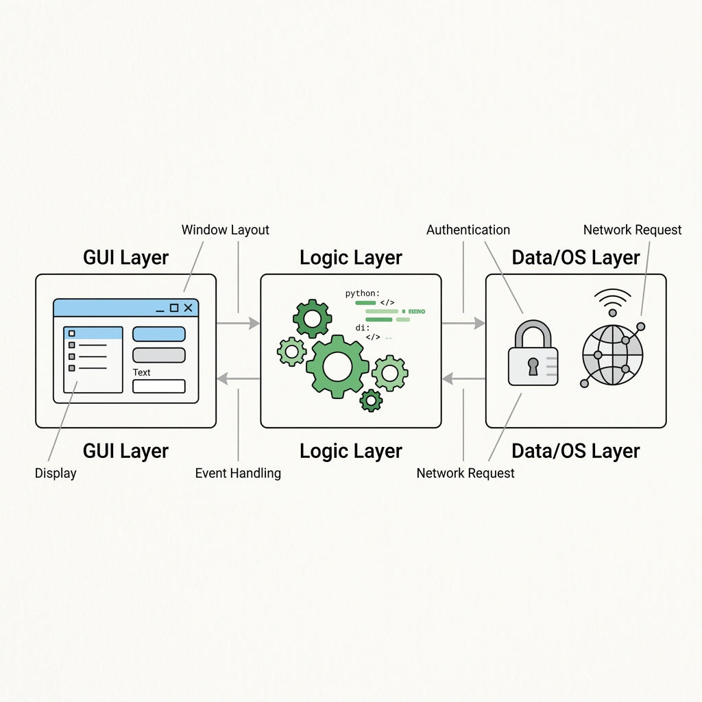

# Chapter 3: Planning a Real Project

It is time to move beyond simple forms and theoretical examples. We are going to build a real-world, production-ready desktop application. 

Instead of a generic calculator or to-do list, we will build a **WiFi Login Automation Tool**. This tool will sit in the Windows system tray and automatically log the user into a captive portal network (like a university or corporate WiFi) whenever it detects a connection.

---

## 🎯 Objectives
By the end of this chapter, you will:
- Define the core requirements of a production desktop application.
- Understand how to structure a Python project for maintainability.
- Analyze the architecture of the WiFi Login tool.
- Recognize the security considerations when handling user credentials.

---

## 📖 Theory

### The Problem Statement
Captive portals require users to manually open a web browser and enter their username and password every time they connect to a specific WiFi network. This is repetitive and annoying.

**Our Solution:** A Windows Desktop application running silently in the background. When the computer connects to the target network, the app detects it, retrieves the securely stored credentials, and performs the login automatically.

### Requirements Definition
Before writing a single line of code, we must define what the app *must* do (Functional) and *how* it must behave (Non-Functional).

**Functional Requirements:**
1. Provide a GUI for the user to enter and save their credentials.
2. Monitor network state changes.
3. Send HTTP POST requests to the captive portal to authenticate.
4. Provide visual feedback (e.g., Toast notifications or system tray icon color changes).

**Non-Functional Requirements:**
1. **Security:** Credentials must NOT be stored in plain text.
2. **Autonomy:** The app should start automatically when Windows boots.
3. **Resilience:** The app should not crash if the network goes down.

---

## 📊 Application Architecture

How do these requirements translate into software components?



Our application is split into three main layers:
1. **The GUI Layer:** The Tkinter interface where the user enters credentials.
2. **The Logic Layer:** The core Python script that manages the event loop, handles HTTP requests (`requests` library), and manages the tray icon (`pystray`).
3. **The OS/Data Layer:** Integration with Windows to store the credentials securely (Windows Credential Manager) and hook into the OS startup folder.

---

## 💻 Folder Structure

A well-organized project is the foundation of maintainable software. For a desktop application, we don't want everything dumped into one folder. Here is the structure we will create for our project:

```text
wifi_auto-login/
│
├── main.py                # The entry point of the application
├── requirements.txt       # Python dependencies
│
├── core/                  # Business logic
│   ├── network.py         # Handles WiFi detection and HTTP requests
│   ├── auth.py            # Handles secure credential storage and retrieval
│   └── logger.py          # Application logging
│
├── gui/                   # User Interface components
│   ├── app_window.py      # The main Tkinter application class
│   └── tray_icon.py       # The system tray implementation
│
└── assets/                # Static files
    ├── icon.ico           # The application icon
    └── logo.png           # Images used in the GUI
```

This modular approach ensures that if we decide to change the GUI framework later (e.g., to PyQt), we only have to rewrite the `gui/` folder, not the `core/` logic.

---

## ⚠ Security Considerations

> [!CAUTION]
> **Never store passwords in `.txt` or `.json` files!**
> It is tempting to write `{"username": "admin", "password": "123"}` to a local configuration file. However, desktop applications run on the user's local machine, meaning *anyone* with access to the computer can read those files. 

We will learn how to use the `keyring` library in Python to safely store passwords directly inside the encrypted **Windows Credential Manager**.

---

## 💡 Tips
- **Design for Failure:** Always assume the network will drop, the captive portal will change its HTML structure, or the user will type the wrong password. Wrap your core logic in `try/except` blocks and log the errors.

---

## 🧪 Exercises
1. Create the `wifi_auto-login` folder structure on your own machine exactly as outlined above.
2. Inside `main.py`, write a simple `print("Starting Application...")`.
3. Research the `requests` library in Python. How would you send a POST request with a username and password?

---

## 📚 Summary
In this chapter, we laid the groundwork for our project. We defined the problem, established the requirements, mapped out the software architecture, and designed a robust folder structure. We also highlighted the critical importance of secure credential storage.

In **Chapter 4**, we will start building out the `gui/` folder by writing the `app_window.py` class!
