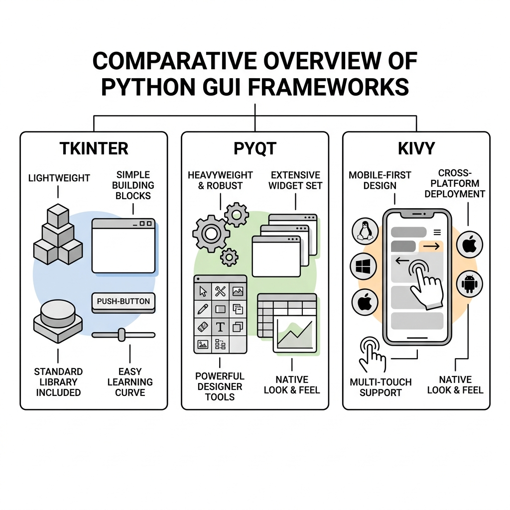

# Chapter 4: The Python GUI Ecosystem

While Tkinter is the built-in standard for Python GUI development, it is not the only option. In fact, Python has a rich and diverse ecosystem of graphical frameworks, each tailored for different use cases. 

Before we commit entirely to Tkinter for our WiFi Login application, it is crucial to understand *why* we are choosing it over the alternatives.

---

## 🎯 Objectives
By the end of this chapter, you will:
- Understand the pros and cons of the major Python GUI frameworks.
- Differentiate between Tkinter, PyQt/PySide, Kivy, and modern wrappers like CustomTkinter.
- Learn how to choose the right framework for a specific project.

---

## 📖 Theory

### The Big Three

When developers ask, "What should I use to build a GUI in Python?", the answer usually falls into one of three categories:

#### 1. Tkinter (The Standard)
Tkinter comes pre-installed with Python. It provides a thin object-oriented layer on top of Tcl/Tk.
- **Pros:** No installation required, extremely lightweight, easy to learn, perfect for simple tools.
- **Cons:** Outdated look out-of-the-box, lacks advanced widgets (like data grids or rich text editors).

#### 2. PyQt / PySide (The Heavyweight)
These are Python bindings for the massive C++ Qt framework. PyQt is dual-licensed (GPL and commercial), while PySide is officially supported by the Qt Company (LGPL).
- **Pros:** Incredibly powerful, native look on all operating systems, huge ecosystem of complex widgets, visual drag-and-drop designer (`Qt Designer`).
- **Cons:** Steep learning curve, very large file size when packaged (often adding 50MB+ to your `.exe`), complex licensing.

#### 3. Kivy (The Mobile/Cross-Platform Choice)
Kivy was built from the ground up for multi-touch applications and cross-platform compatibility.
- **Pros:** Runs on Windows, macOS, Linux, iOS, and Android. Highly customizable UI driven by OpenGL.
- **Cons:** Does not look like a native Windows application. Can be frustrating to package for desktop.

### Modern Tkinter Options

If you love the simplicity of Tkinter but hate how it looks like a Windows 95 application, the community has provided solutions:

- **CustomTkinter:** A modern, customizable UI library built on top of Tkinter. It provides dark mode, rounded corners, and smooth animations without sacrificing Tkinter's ease of use.
- **ttkbootstrap:** A theme extension for Tkinter that applies beautiful, flat Bootstrap-style themes to standard widgets.

---

## 📊 Decision Matrix

How do you choose? Use this simple matrix:

| Project Requirement | Recommended Framework |
| :--- | :--- |
| I need a tiny `.exe` file. | **Tkinter** |
| I am building an enterprise dashboard with charts. | **PyQt / PySide** |
| I want it to run on Android. | **Kivy** |
| I want a sleek dark-mode desktop app easily. | **CustomTkinter** |
| I am building a background system tray tool. | **Tkinter** + `pystray` |

---

## ⚠ Why Tkinter for our WiFi Tool?

> [!NOTE]
> For our WiFi Login application, we are sticking with standard **Tkinter**. Why? Because our application is primarily a background task. The GUI is only a simple settings window to store credentials. Using PyQt would blow up our application size by 50MB just to display two text fields! We prioritize **lightweight footprint** and **simplicity**.

---

## 💡 Tips
- **Don't over-engineer:** If a simple tool only needs a few buttons, do not reach for a heavyweight framework just because it looks slightly better. Standard Tkinter is often "good enough."
- **Separate logic from UI:** If you keep your network and authentication logic in a separate file (as we planned in Chapter 3), switching from Tkinter to PyQt later becomes incredibly easy.

---

## 🧪 Exercises
1. Research **CustomTkinter** on GitHub. Look at the screenshot examples. How does it compare to the standard Tkinter forms we built in Chapter 2?
2. Open your terminal and run `pip install ttkbootstrap`. (We won't use it for the final project, but it is great to know it exists!).

---

## 📚 Summary
In this chapter, we surveyed the Python GUI landscape. We learned that while PyQt is the undisputed king of complex applications and Kivy rules the cross-platform mobile space, **Tkinter** remains the best choice for lightweight, fast, and simple desktop utilities. 

In **Chapter 5**, we will tackle one of the hardest concepts in desktop development: **Event-Driven Programming** and why long-running tasks freeze your interface.
