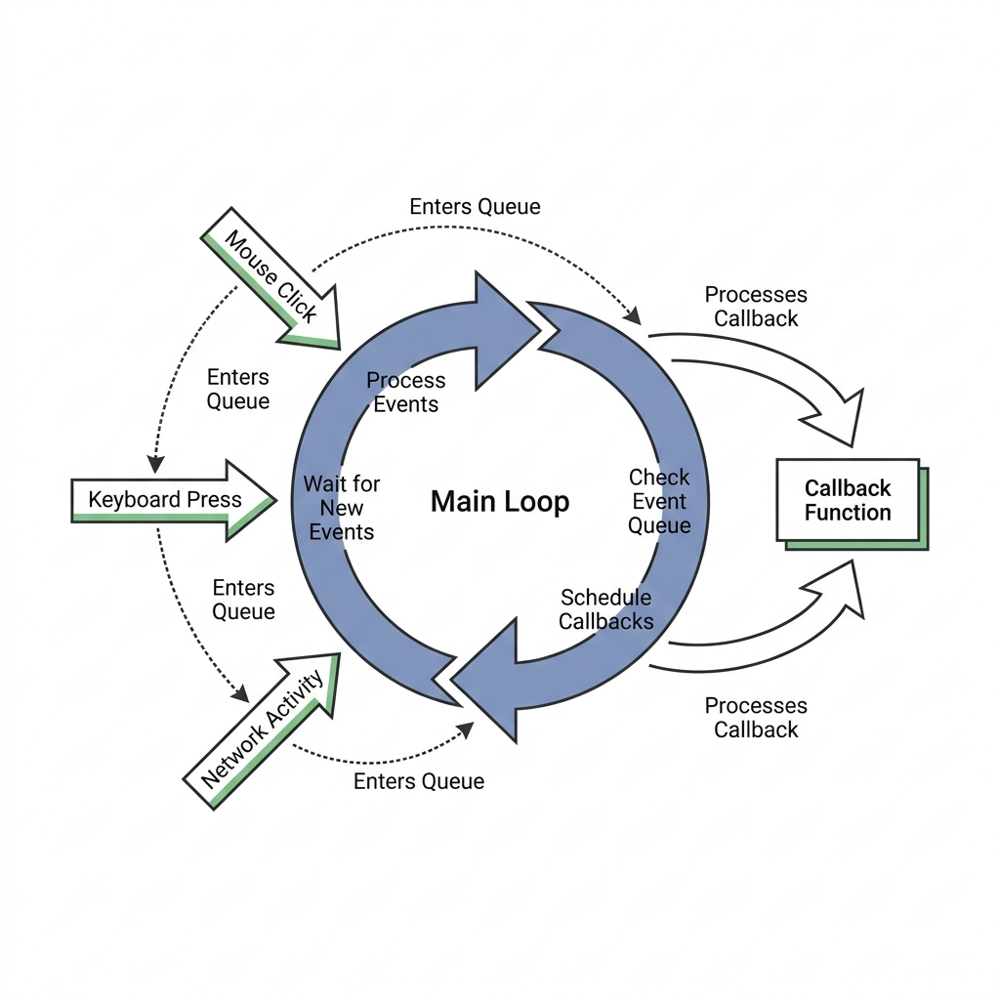

# Chapter 5: Event-Driven Programming

If you have only ever written procedural Python scripts (scripts that run top-to-bottom and then exit), desktop application development requires a massive shift in mindset. 

You are no longer writing code that dictates the flow of time. You are writing code that **waits for the user to do something**. This is the essence of Event-Driven Programming.

---

## 🎯 Objectives
By the end of this chapter, you will:
- Understand the mechanics of the Main Event Loop.
- Learn what "Blocking the UI" means and why it happens.
- Discover how to use Python's `threading` module to keep your GUI responsive during long tasks.

---

## 📖 Theory

### The Main Event Loop

When you call `root.mainloop()` in Tkinter, you are handing control of your program over to an infinite `while` loop running deep inside the Tkinter library.

This loop has one job: Wait for events (mouse clicks, keyboard presses, window resizing) and dispatch them to the appropriate functions in your code.



### Callbacks
A **Callback** is a function that you pass to the GUI framework, essentially saying: *"Hey Tkinter, don't run this function now. Run it later, only when the user clicks this button."*

```python
def my_callback():
    print("Button was clicked!")

# Passing the function WITHOUT parentheses!
btn = tk.Button(root, text="Click Me", command=my_callback)
```

### The "Frozen UI" Problem (Blocking)

Because Tkinter runs entirely on a single thread (the Main Thread), the Event Loop can only do one thing at a time. It is either:
1. Drawing the GUI and listening for events, OR
2. Running your callback function.

**What happens if your callback function takes 10 seconds to run?** (For example, downloading a large file or trying to connect to a slow WiFi network).

During those 10 seconds, the Event Loop is paused. It cannot redraw the screen. It cannot process a "Cancel" button click. The OS will notice the window has stopped responding to messages and will append **"(Not Responding)"** to the title bar.

This is the cardinal sin of Desktop Development: **Blocking the Main Thread.**

---

## 💻 Code Examples: Threading to the Rescue

To fix the frozen UI problem, we must offload heavy work to a **Background Thread**. This allows the Main Thread to immediately return to the Event Loop to keep the UI snappy.

Here is the wrong way (Blocking):

```python
import tkinter as tk
import time

def slow_login_task():
    print("Logging in...")
    time.sleep(5)  # Simulates a slow network request
    print("Done!")

root = tk.Tk()
tk.Button(root, text="Login (Will Freeze!)", command=slow_login_task).pack()
root.mainloop()
```

Here is the correct way using the `threading` module:

```python
import tkinter as tk
import threading
import time

def background_login_task():
    print("Logging in...")
    time.sleep(5) # This sleep happens on the background thread!
    print("Done!")

def start_login_thread():
    # Create a new thread pointing to our slow task
    t = threading.Thread(target=background_login_task)
    # Start the thread in the background
    t.start()
    # The function ends instantly, returning control to Tkinter!

root = tk.Tk()
tk.Button(root, text="Login (Responsive!)", command=start_login_thread).pack()
root.mainloop()
```

---

## ⚠ Common Mistakes

> [!WARNING]
> **Updating the GUI from a Background Thread:**
> Tkinter is NOT thread-safe. You should never update a Tkinter widget (like `my_label.config(text="Success")`) directly from inside a background thread. Doing so will cause random, unpredictable crashes.
> 
> *Best Practice:* Use a background thread to do the heavy lifting (math, network requests, disk I/O), but use Tkinter's `root.after()` method to schedule the actual UI update back on the Main Thread.

---

## 💡 Tips
- Keep your callbacks as short and fast as possible.
- If a task takes longer than 50 milliseconds, put it in a background thread.
- Use `daemon=True` when creating threads (`threading.Thread(..., daemon=True)`). This ensures that if the user closes the main window, all background threads are instantly killed instead of keeping the program running invisibly in the background.

---

## 🧪 Exercises
1. Run the "Blocking" code example. Try to click and drag the window while the 5-second sleep is happening. What happens?
2. Run the "Responsive" code example. Try to click and drag the window during the sleep. Notice the difference?
3. Modify the responsive example so that the button disables itself (`state=tk.DISABLED`) when clicked, and enables itself again after the background thread finishes. *(Hint: Research how to safely communicate between threads using queues or `root.after()`)*.

---

## 📚 Summary
In this chapter, we conquered the Event Loop. We learned why applications freeze when doing heavy work and how to utilize the `threading` module to keep our applications responsive and professional. 

Because our WiFi Login tool will be making HTTP requests over the network, threading will be absolutely critical to its success.

In **Chapter 6**, we will wrap up Part I by looking at the rules of designing clean, professional User Interfaces.
