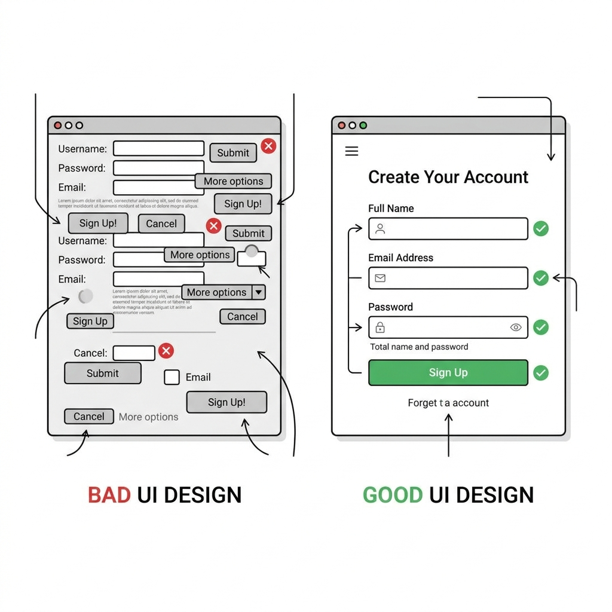

# Chapter 6: Designing Good User Interfaces

A desktop application can have the most brilliant, threaded, secure Python backend in the world, but if the User Interface (UI) is ugly or confusing, users will refuse to use it. 

In this chapter, we explore the fundamental principles of UI design and how to apply them to Tkinter to make our applications look professional, modern, and trustworthy.

---

## 🎯 Objectives
By the end of this chapter, you will:
- Understand the core principles of UI design: Alignment, Spacing, and Typography.
- Learn how to escape the default "Windows 95" look of Tkinter.
- Analyze the difference between good and bad UI layouts.

---

## 📖 Theory

### The Three Pillars of Good UI

When developers build their first GUI, they often cram every possible widget into the smallest possible window. The result is a chaotic, intimidating mess. To fix this, we rely on three pillars:



#### 1. Alignment
Every element on your screen should have a visual connection with another element. 
- Avoid scattered widgets.
- Use `grid` heavily to ensure text boxes align perfectly with each other on the left or right edges.

#### 2. Spacing (Whitespace is your friend!)
Cramped interfaces create anxiety. Padding (the empty space around an element) gives your UI "room to breathe."
- In Tkinter, use `padx` and `pady` liberally. 
- *Rule of thumb:* A 10-pixel pad around all major elements is a good starting point.

#### 3. Typography
The default Tkinter font is often small and outdated. Changing the font to a modern sans-serif typeface instantly upgrades the look of your app.
- Good choices: `Segoe UI` (Standard on modern Windows), `Helvetica`, `Arial`.
- Avoid mixing more than two fonts in an application.

---

## 💻 Code Examples: Upgrading Tkinter

Let's look at how to apply these pillars to standard Tkinter.

**The Bad Way (Cramped and Default):**
```python
import tkinter as tk

root = tk.Tk()
tk.Label(root, text="Username").grid(row=0, column=0)
tk.Entry(root).grid(row=0, column=1)
tk.Button(root, text="Submit").grid(row=1, column=1)
root.mainloop()
```

**The Good Way (Styled and Padded):**
```python
import tkinter as tk

root = tk.Tk()
root.title("Clean Login")
root.geometry("350x150")

# Define a modern font tuple
CUSTOM_FONT = ("Segoe UI", 11)

# Apply padding and fonts
tk.Label(root, text="Username:", font=CUSTOM_FONT).grid(row=0, column=0, padx=20, pady=20, sticky="e")
tk.Entry(root, font=CUSTOM_FONT, width=20).grid(row=0, column=1, padx=10, pady=20)

# Add a styled button
btn = tk.Button(root, text="Submit", font=CUSTOM_FONT, bg="#0078D7", fg="white", relief="flat")
btn.grid(row=1, column=1, sticky="w", padx=10)

root.mainloop()
```

By adding `padx/pady`, changing the font to `Segoe UI`, and giving the button a flat blue Windows 10/11 color scheme (`bg="#0078D7"`), the form looks 10x more professional.

---

## ⚠ Common Mistakes

> [!CAUTION]
> **Relying entirely on fixed window sizes.** 
> Setting `root.geometry("400x400")` and then hardcoding pixel placements via `.place(x=50, y=100)` is a disaster waiting to happen. What if the user has a 4K monitor with 150% scaling? Your text will overflow, and your buttons will be inaccessible. 
> *Always use `grid` or `pack` so your UI can dynamically resize to fit its contents.*

---

## 💡 Tips
- **Consistency is key:** If your "Save" button is blue on one screen, it must be blue on all screens.
- **Use standard OS colors where possible:** Users are comfortable with their operating system. A button that looks like a standard Windows button feels safer to click than a neon green box.
- **Provide Feedback:** If a user clicks a button and a 2-second background thread starts, change the button text to "Loading..." or show a progress bar. Never leave the user wondering if their click registered.

---

## 🧪 Exercises
1. Take the "Good Way" code example above and run it. 
2. Modify the code to add a title label at the very top (Row 0, spanning 2 columns) that says "Welcome Back" in a large, bold font (`("Segoe UI", 16, "bold")`). Don't forget to push the other rows down!
3. Look up the Tkinter `ttk` (Themed Tkinter) module. How does a `ttk.Button` differ visually from a standard `tk.Button`?

---

## 📚 Summary
In this final foundational chapter, we learned that good UI design is largely about discipline: maintaining alignment, enforcing generous padding, and selecting modern typography. 

We have now completed **Part I — Foundations**. You understand how desktop apps work, how to navigate the GUI ecosystem, the absolute necessity of the Event Loop and threading, and how to design clean interfaces.

**You are now ready to build.** In **Part II**, we will roll up our sleeves and start writing the code for the WiFi Login Automation tool!
