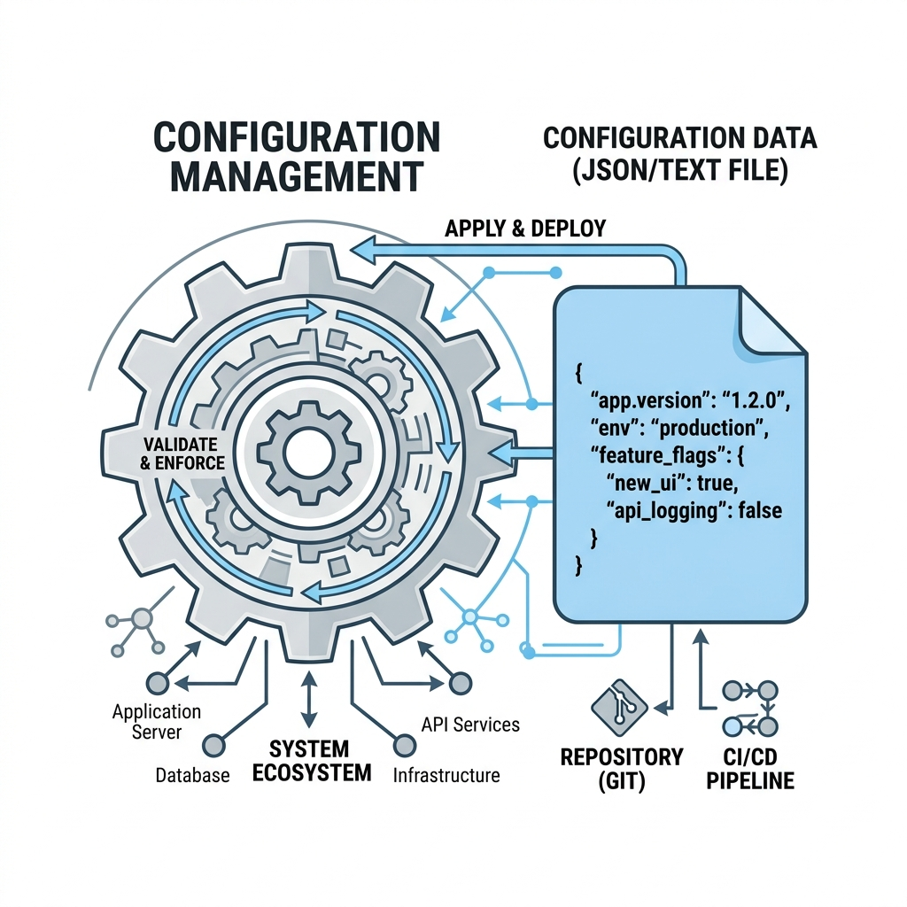

# Chapter 7: Configuration Management

Every application needs a brain—a place to remember user preferences, window sizes, or target URLs across reboots. Hardcoding these values directly into your Python script is a terrible practice because it forces you to recompile the app every time a setting changes. 

In this chapter, we explore how to manage application configuration externally.

---

## 🎯 Objectives
By the end of this chapter, you will:
- Understand the difference between INI, JSON, and YAML configuration files.
- Learn how to read and write JSON configuration in Python.
- Understand the concept of "sensible defaults" to prevent crashes on first launch.

---

## 📖 Theory

### The Configuration File

A configuration (config) file is a simple text document stored on the user's hard drive that the application reads when it starts up.



There are three dominant formats for config files:

1. **INI files (`config.ini`):** The classic Windows format. Easy to read, but struggles with complex, nested data (like lists of lists). Python has a built-in `configparser` module for this.
2. **JSON (`config.json`):** The modern web standard. Extremely fast to parse and natively supports nested dictionaries and lists. Python has a built-in `json` module.
3. **YAML (`config.yaml`):** Highly readable for humans, but requires installing an external library (`PyYAML`) which increases the size of your application.

For our WiFi Login application, we will use **JSON** because it perfectly maps to Python dictionaries and requires zero external dependencies.

### What goes in a Config File?
- ✅ The target URL of the captive portal.
- ✅ The user's preference for starting the app on boot (True/False).
- ✅ The threshold for network retry attempts.
- ❌ **Passwords or Tokens.** (We cover secure storage in Chapter 9).

---

## 💻 Code Examples: Building a Config Manager

Let's build a robust `ConfigManager` class that will handle reading, writing, and providing defaults if the config file gets deleted.

```python
import json
import os

class ConfigManager:
    def __init__(self, filepath="config.json"):
        self.filepath = filepath
        self.config = {}
        self.load_config()

    def get_defaults(self):
        return {
            "target_url": "http://captive.apple.com",
            "run_on_startup": True,
            "retry_attempts": 3,
            "theme": "dark"
        }

    def load_config(self):
        if not os.path.exists(self.filepath):
            # If the file doesn't exist, create it with defaults!
            self.config = self.get_defaults()
            self.save_config()
        else:
            # Read the existing file
            try:
                with open(self.filepath, 'r') as f:
                    self.config = json.load(f)
            except json.JSONDecodeError:
                print("Config file corrupted. Reverting to defaults.")
                self.config = self.get_defaults()
                self.save_config()

    def save_config(self):
        with open(self.filepath, 'w') as f:
            json.dump(self.config, f, indent=4)

    def get(self, key):
        return self.config.get(key, self.get_defaults().get(key))

    def set(self, key, value):
        self.config[key] = value
        self.save_config()
```

### Why is this class robust?
1. **Self-Healing:** If the user accidentally deletes `config.json`, the app won't crash. It seamlessly generates a new one using `get_defaults()`.
2. **Corruption Handling:** If the user opens `config.json` and ruins the formatting, the `try/except` block catches the `JSONDecodeError` and resets it gracefully.
3. **Safe Access:** The `.get(key)` method always falls back to the default if a specific key goes missing.

---

## ⚠ Common Mistakes

> [!WARNING]
> **Saving in the installation directory:** 
> When you package a Python app to an `.exe` and install it in `C:\Program Files\`, your application **does not have permission to write to that folder**. If you try to save `config.json` next to your `.exe`, the app will crash with an `Access Denied` error!
> 
> *In Chapter 19, we will learn how to properly save this file in the user's `AppData` folder.*

---

## 💡 Tips
- **Use `indent=4`:** When calling `json.dump()`, always pass `indent=4`. This formats the JSON file beautifully with line breaks and tabs, making it easy for advanced users to manually edit the file.
- **Never trust user input:** If you read an integer from a config file (like `retry_attempts`), validate it before using it in a network loop. A user might manually edit the JSON and change `3` to `"three"`, crashing your app.

---

## 🧪 Exercises
1. Create a `config_test.py` script, copy the `ConfigManager` class into it, and instantiate it.
2. Call `manager.set("theme", "light")`. Check your folder—did `config.json` appear? Open it in a text editor to verify the JSON structure.
3. Manually open `config.json`, delete a curly brace `{` to corrupt it, and run your script again. Watch how the class heals the file.

---

## 📚 Summary
Configuration management is about giving your application memory across reboots. By using a robust JSON manager with sensible defaults and error handling, you ensure your app is resilient to user tampering.

In **Chapter 8**, we will tackle another critical piece of application infrastructure: **Logging**. When your app is running silently in the system tray, how do you know what it's doing?
