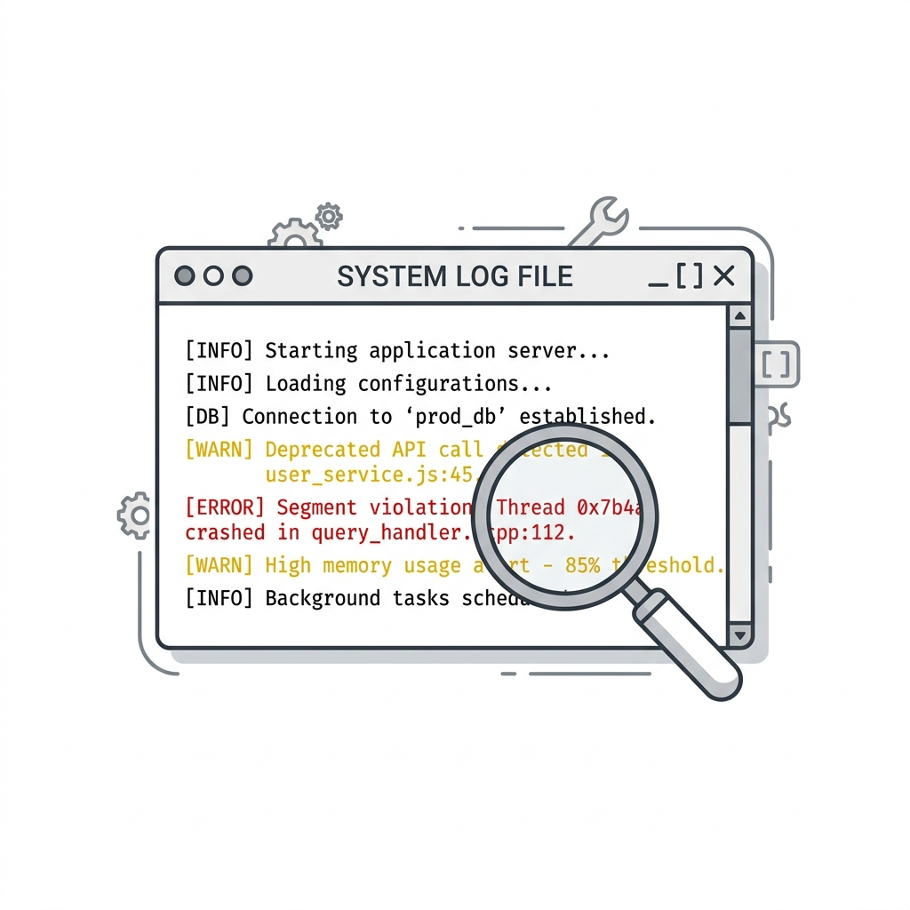

# Chapter 8: Logging

When you write a simple script, `print()` is your best friend. But when you build a desktop application that compiles into a `.exe` and runs silently in the system tray, there is no terminal window! If the application crashes or the WiFi login fails, how will you ever know what happened?

This is where the standard Python `logging` module becomes critical.

---

## 🎯 Objectives
By the end of this chapter, you will:
- Understand why `print()` is useless in production desktop apps.
- Learn how to configure Python's `logging` module to write to a file.
- Understand log levels (`DEBUG`, `INFO`, `WARNING`, `ERROR`, `CRITICAL`).
- Build a robust logging setup for the WiFi Login application.

---

## 📖 Theory

### The Problem with Print
If your application runs as a "windowed" application (which means no black console window pops up), any `print()` statement you write goes into a black hole. Worse, if your application encounters an unhandled exception, it will crash silently and disappear, leaving the user confused.

### Enter the Logger
A **Logger** solves this by writing messages directly to a file on the hard drive (e.g., `app.log`).



### Log Levels
Not all messages are equally important. The `logging` module categorizes messages by severity:

| Level | Usage | Example |
| :--- | :--- | :--- |
| **DEBUG** | Detailed diagnostic information. | `logging.debug("HTTP GET status 200")` |
| **INFO** | General milestones. | `logging.info("Application started.")` |
| **WARNING** | Something unexpected happened, but the app is still running. | `logging.warning("Config file missing. Using defaults.")` |
| **ERROR** | A serious problem occurred; a function failed. | `logging.error("Failed to connect to captive portal.")` |
| **CRITICAL**| A fatal error; the program may crash. | `logging.critical("Corrupted memory!")` |

You can configure the logger to only save messages *above* a certain level. For example, if you set the level to `WARNING`, it will ignore all `DEBUG` and `INFO` messages, saving disk space.

---

## 💻 Code Examples: Setting up the Logger

Here is a standard, robust configuration for a desktop application. It formats the log messages to include the date, time, and severity level, and writes them to a file named `wifi_login.log`.

```python
import logging
import sys

def setup_logger():
    # 1. Create a custom logger
    logger = logging.getLogger("WiFiApp")
    logger.setLevel(logging.DEBUG) # Catch everything

    # 2. Create handlers (File and Console)
    file_handler = logging.FileHandler("wifi_login.log", mode='a') # 'a' for append
    console_handler = logging.StreamHandler(sys.stdout)

    # 3. Create formatters and add it to handlers
    log_format = logging.Formatter('%(asctime)s - %(levelname)s - %(message)s')
    file_handler.setFormatter(log_format)
    console_handler.setFormatter(log_format)

    # 4. Add handlers to the logger
    logger.addHandler(file_handler)
    logger.addHandler(console_handler)

    return logger

# Usage:
log = setup_logger()
log.info("Application initialized.")
log.error("Network interface not found!")
```

If you run this code and open `wifi_login.log` in Notepad, you will see beautifully formatted entries:
```text
2026-08-01 14:22:10,123 - INFO - Application initialized.
2026-08-01 14:22:10,125 - ERROR - Network interface not found!
```

---

## ⚠ Common Mistakes

> [!CAUTION]
> **Logging Passwords!**
> Never, ever write `logger.info(f"Logging in with password: {password}")`. Log files sit in plain text on the hard drive. If you log a credential, you have compromised your user's security. If you need to log an authentication attempt, log the action, not the payload: 
> *Good:* `logger.info(f"Attempting login for user: {username}")`

---

## 💡 Tips
- **Catching global crashes:** You can use `sys.excepthook` in Python to catch unhandled exceptions and pipe them directly into your logger before the app crashes. This is a lifesaver for debugging `.exe` files!
- **Log Rotation:** If your app runs 24/7 in the system tray, `wifi_login.log` could eventually grow to 10GB. Look into `logging.handlers.RotatingFileHandler` to automatically delete old logs.

---

## 🧪 Exercises
1. Run the `setup_logger()` code above. Check your folder for `wifi_login.log`.
2. Add a `try/except` block that intentionally divides by zero. Inside the `except Exception as e:`, use `log.error(f"Math crashed: {e}")`. Check the log file.
3. Research `RotatingFileHandler`. How would you configure it to keep a maximum of 3 log files, each no larger than 1MB?

---

## 📚 Summary
Logging is your application's black box flight recorder. By replacing `print()` with a properly configured file logger, you guarantee that when things go wrong in production, you will have the exact trace of what happened.

In **Chapter 9**, we tackle the most sensitive part of our application: **Credential Management**. How do we safely store the user's WiFi password?
