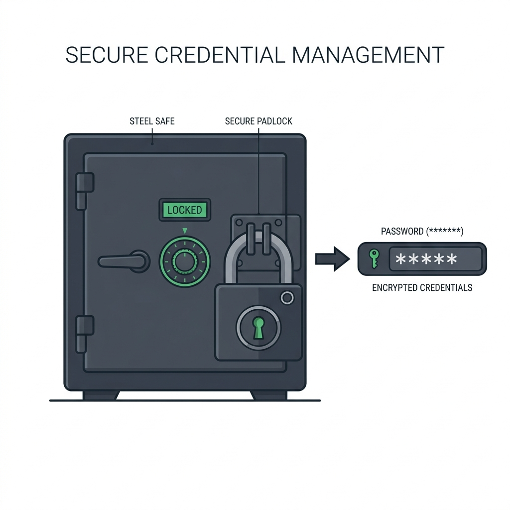

# Chapter 9: Credential Management

In Chapter 7, we learned how to store configuration settings in a JSON file. It might seem tempting to store the user's WiFi password in that same JSON file. **Do not do this.** 

Storing passwords in plain text is a massive security vulnerability. Any other program running on the user's computer, or anyone who gains physical access to the hard drive, can instantly steal the password. 

In this chapter, we will learn how to integrate Python with the **Windows Credential Manager** to store secrets securely.

---

## 🎯 Objectives
By the end of this chapter, you will:
- Understand the risks of plain-text credential storage.
- Learn what the Windows Credential Manager is.
- Master the Python `keyring` library to securely store and retrieve passwords.

---

## 📖 Theory

### The Windows Credential Manager

Windows has a built-in, highly secure vault designed specifically for storing passwords. It encrypts the passwords using the user's Windows login credentials. This means that even if a hacker steals the hard drive, they cannot read the passwords without also knowing the user's Windows PIN or password.



### The `keyring` Library

Instead of interacting directly with the complex C++ Windows APIs, the Python community has built a library called `keyring`. 

`keyring` provides a unified interface. If you run your code on Windows, it talks to the Windows Credential Manager. If you run it on macOS, it talks to the macOS Keychain. This abstraction is incredibly powerful.

---

## 💻 Code Examples: Using Keyring

First, you must install the library:
`pip install keyring`

Here is how simple it is to use:

```python
import keyring

# Define a "namespace" for our app so it doesn't conflict with other apps
APP_NAME = "WiFiAutoLoginApp"

def save_credentials(username, password):
    # This securely stores the password in the Windows vault!
    keyring.set_password(APP_NAME, username, password)
    print("Password securely saved.")

def get_credentials(username):
    # This retrieves the password
    password = keyring.get_password(APP_NAME, username)
    if password:
         return password
    else:
         print("Password not found.")
         return None

def delete_credentials(username):
    # Deletes the entry from the vault
    try:
        keyring.delete_password(APP_NAME, username)
        print("Credentials deleted.")
    except keyring.errors.PasswordDeleteError:
        print("No credentials existed to delete.")
```

### Verifying it worked
If you run `save_credentials("student", "my_secret_wifi_pass")`, you can actually go into Windows and verify it!
1. Press the Windows Key and type "Credential Manager".
2. Open the control panel applet.
3. Click on "Windows Credentials".
4. Scroll down to "Generic Credentials". You will see an entry for `WiFiAutoLoginApp`!

---

## ⚠ Common Mistakes

> [!WARNING]
> **Losing the Username:**
> `keyring.get_password()` requires **two** arguments: the App Name and the Username. If you only save the password in the vault, but you forget what the username is, you cannot retrieve the password!
> 
> *Best Practice:* Store the `username` in your standard plain-text `config.json` file. Read the username from the config file, and then use that username to fetch the secure password from `keyring`.

---

## 💡 Tips
- **Handling UI state:** If `keyring.get_password()` returns `None`, it means the user hasn't set up the app yet. Use this logic to automatically pop up the Tkinter Login Window. If it returns a password, bypass the GUI and log in silently!
- **Error Handling:** Sometimes the user's OS keyring is locked or corrupted. Wrap `get_password` in a `try/except` block and prompt the user to re-enter their password if it fails.

---

## 🧪 Exercises
1. `pip install keyring` and run the code example on your machine.
2. Open the Windows Credential Manager GUI and find the entry you just created.
3. Write a small script that asks the user to `input("Enter your new password: ")`, saves it to the keyring, and then prints it back out using `get_password()`.
4. Delete the password using `delete_credentials()` and verify it disappeared from the Windows Credential Manager.

---

## 📚 Summary
By leveraging the `keyring` library, we have completely secured the most sensitive part of our application. We now have a robust config file for general settings and a secure vault for the password.

In **Chapter 10**, we will build the final piece of the core logic: **Networking**. We will learn how to detect if we are connected to the network and how to send the HTTP POST request to bypass the captive portal.
